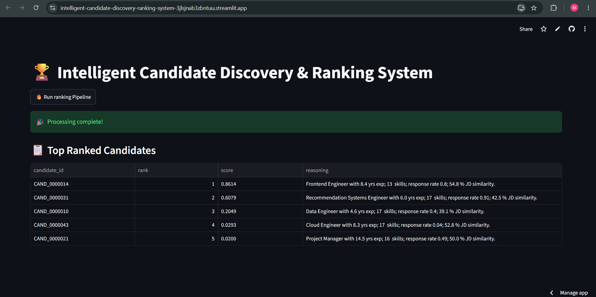
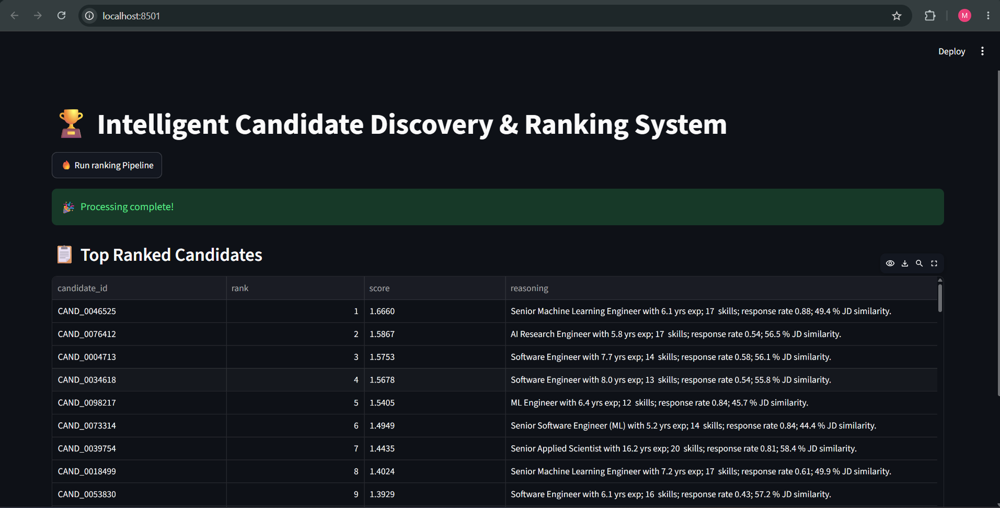

# 🏆 Intelligent Candidate Discovery & Ranking System

An optimized AI-powered Candidate Discovery & Ranking System that identifies, filters, and ranks high-quality candidates from large recruitment datasets using semantic similarity, behavioral intelligence, and business-rule filtering. The system combines adaptive multi-process preprocessing, duplicate elimination, and transformer-based semantic ranking to generate recruiter-ready candidate shortlists through an interactive Streamlit dashboard while executing completely offline.

🌐 **Live Demo:** https://intelligent-candidate-discovery-ranking-system-3jlsjnab3zbntuu.streamlit.app/

📂 **GitHub Repository:** https://github.com/Mirthikha/Intelligent-Candidate-Discovery-Ranking-System


## 🚀 Performance Benchmarks

- **Execution Time:** ~2.5 minutes
- **Evaluation System:** Windows, 16 GB RAM, 12 CPU Cores
- **Execution Mode:** Fully Offline (No Internet Required)
- **Processing Strategy:** Adaptive Multi-Process Parallel Execution

## 🚀 Professional GitHub badges 

<p align="left">


</p>


# 📖 Table of Contents

- [Problem Statement](#-problem-statement)
- [Solution Overview](#-solution-overview)
- [Key Features](#-key-features)
- [System Architecture](#-system-architecture)
- [Three-Level Candidate Filtering](#-three-level-candidate-filtering)
- [Adaptive Parallel Processing](#-adaptive-parallel-processing)
- [Dynamic Embedding Optimization](#-dynamic-embedding-optimization)
- [Duplicate Elimination](#-duplicate-elimination)
- [Semantic Ranking Pipeline](#-semantic-ranking-pipeline)
- [Performance Benchmarks](#-performance-benchmarks)
- [Project Structure](#-project-structure)
- [Installation](#-installation)
- [Running the Project](#-running-the-project)
- [Streamlit Deployment](#-streamlit-deployment)
- [Results](#-results)
- [Future Improvements](#-future-improvements)
- [Author](#-author)


# 🧠 Problem Statement

Modern recruitment platforms often rely on keyword-based filtering to identify suitable candidates. While simple to implement, keyword matching fails to capture semantic meaning, transferable skills, and contextual experience. As a result, highly qualified candidates may be overlooked simply because their profiles use different terminology than the job description.

Large-scale candidate datasets further increase the challenge by introducing duplicate profiles, inconsistent profile quality, behavioral noise, and candidates who do not satisfy mandatory business requirements.

The objective of this project is to build an efficient AI-powered candidate discovery and ranking system capable of processing large candidate datasets, eliminating unsuitable and duplicate profiles, understanding semantic relationships between candidate profiles and job descriptions, and producing a high-quality ranked shortlist within strict CPU execution and time constraints.


# 💡 Solution Overview

This project implements a fully offline, end-to-end Candidate Discovery & Ranking System that combines business rule-based filtering, behavioral score, semantic embeddings, cosine similarity and similarity-based ranking to identify the most relevant candidates.

The solution begins with an adaptive multi-process three-level candidate filtering pipeline that efficiently processes large candidate datasets. It then removes duplicate candidate profiles using MinHash and MinHashLSH before generating semantic embeddings with a locally stored SentenceTransformer (all-MiniLM-L6-v2) model. Embedding generation is further optimized through adaptive CPU thread allocation and dynamic batch sizing based on the available hardware resources.

Finally, cosine similarity between the candidate embeddings and the job description embedding is combined with a behavioral multiplier to compute a final ranking score. The ranked candidates are presented through an interactive Streamlit interface and exported as CSV and Excel outputs.

The entire pipeline is designed to execute completely offline without requiring external APIs or internet connectivity.

The solution is designed to efficiently process approximately 100,000 candidate profiles while satisfying the challenge's CPU execution constraint through adaptive parallel preprocessing and optimized embedding inference.


# ⭐ Key Features

- ⚡ **Adaptive Multi-Process Parallel Processing** that automatically detects available logical CPU cores, reserves system resources, and utilizes up to **10 worker processes** for efficient preprocessing.

- 📦 **Dynamic Workload Chunking** by splitting approximately **100,000 candidate profiles into 5,000-record batches** for fast, scalable and memory-efficient execution.

- 🧠 **Adaptive CPU-aware Embedding Optimization** that dynamically selects optimal **PyTorch thread allocation** and **embedding batch size** based on available hardware resources.

- 🚀 **Performance-Optimized Pipeline** capable of processing approximately **100,000 candidate profiles** in **~2.5 minutes** through adaptive parallel preprocessing, optimized embedding inference, and efficient duplicate elimination.

- 🚀 **Adaptive Three-Level Candidate Filtering Architecture** for progressive candidate elimination before semantic ranking.

- 🤖 **Fully Offline Semantic Ranking** using a locally stored **SentenceTransformer (all-MiniLM-L6-v2)** model without requiring external APIs or internet connectivity.

- 🔍 **Near-Duplicate Candidate Detection** using **MinHash** and **MinHashLSH** to eliminate redundant candidate profiles before embedding generation.

- 📊 **Behavioral Intelligence Scoring** using recruiter response rate, dormancy, professional experience, GitHub activity, geographic preference, job stability, offer acceptance behaviour, and honeypot title detection.

- 🎯 **Hybrid Ranking Strategy** combining **Behavioral Multiplier × Cosine Similarity** to produce recruiter-ready candidate rankings.

- 📄 **Automatic CSV & Excel Export** of ranked candidates for downstream recruitment workflows.

- 🛡️ **Privacy-Friendly Offline Architecture** ensuring all inference is performed locally without transmitting candidate data to external services.


# 🏗️ System Architecture 

```text
                    ┌───────────────────────────────┐
                    │ Candidate Dataset (~100K)     │
                    └──────────────┬────────────────┘
                                   │
                                   ▼
      ┌──────────────────────────────────────────────────────────┐
      │ Adaptive Parallel Preprocessing                          │
      │----------------------------------------------------------│
      │ • Detect available logical CPU cores                     │
      │ • Reserve 2 cores for OS responsiveness                  │
      │ • Utilize up to 10 worker processes                      │
      │ • Split dataset into 5,000-record chunks                 │
      │ • Process chunks concurrently using                      │
      │   ProcessPoolExecutor                                    │
      └──────────────────────┬───────────────────────────────────┘
                             │
                             ▼
      ┌──────────────────────────────────────────────────────────┐
      │ Three-Level Candidate Filtering                          │
      │----------------------------------------------------------│
      │ Level 1 → Soft Disqualification                          │
      │ Level 2 → Hard Disqualification                          │
      │ Level 3 → Behavioral Multiplier Calculation              │
      └──────────────────────┬───────────────────────────────────┘
                             │
                             ▼
      ┌──────────────────────────────────────────────────────────┐
      │ Candidate DataFrame Construction                         │
      └──────────────────────┬───────────────────────────────────┘
                             │
                             ▼
      ┌──────────────────────────────────────────────────────────┐
      │ MinHash + MinHashLSH                                     │
      │ Near-Duplicate Candidate Elimination                     │
      └──────────────────────┬───────────────────────────────────┘
                             │
                             ▼
      ┌──────────────────────────────────────────────────────────┐
      │ Candidate Profile Text Generation                        │
      └──────────────────────┬───────────────────────────────────┘
                             │
                             ▼
      ┌──────────────────────────────────────────────────────────┐
      │ SentenceTransformer (all-MiniLM-L6-v2)                   │
      │----------------------------------------------------------│
      │ Adaptive Embedding Optimization                          │
      │ • Detect logical CPU cores                               │
      │ • Dynamic PyTorch thread allocation                      │
      │ • Dynamic embedding batch size selection                 │
      └──────────────────────┬───────────────────────────────────┘
                             │
              ┌──────────────┴──────────────┐
              ▼                             ▼
     Job Description                 Candidate Profiles
        Embedding                       Embeddings
              └──────────────┬──────────────┘
                             ▼
                 Cosine Similarity Calculation
                             │
                             ▼
        Behavioral Multiplier × Semantic Similarity
                             │
                             ▼
                  Final Candidate Score
                             │
                             ▼
                Ranked Candidate Shortlist
                             │
               ┌─────────────┴─────────────┐
               ▼                           ▼
         CSV / Excel Export         Streamlit Dashboard


```


# ⚙️ Three-Level Candidate Filtering

The system progressively filters and scores candidates before semantic ranking. This staged architecture minimizes unnecessary transformer inference while ensuring that only high-quality candidates proceed to the final ranking stage.

| Level | Objective | Major Checks |
|--------|-----------|--------------|
| 🟢 Level 1 | Soft Disqualification | Recruiter engagement, NLP & LLM assessment scores, salary validation |
| 🔴 Level 2 | Hard Disqualification | Service-company rule, mandatory IR/NLP skills |
| 🟡 Level 3 | Behavioral Multiplier | Multi-factor behavioral scoring before semantic ranking |

---

## 🟢 Level 1 – Soft Disqualification

**Purpose:** Eliminate obviously weak or inconsistent profiles at minimal computational cost.

**Checks Performed**

- Recruiter Search Appearances vs Recruiter Saves
- NLP Assessment Score
- Fine-Tuning LLM Assessment Score
- Salary Mismatch

---

## 🔴 Level 2 – Hard Disqualification

**Purpose:** Apply mandatory business rules derived from the job description.

**Checks Performed**

- Entire career only in service-based companies
- Missing mandatory Information Retrieval (IR) / NLP skills

---

## 🟡 Level 3 – Behavioral Multiplier Calculation

Instead of rejecting candidates, this stage calculates a **Behavioral Multiplier** that influences the final ranking score.

### Multipliers Included

- 👻 Ghosting Score
  - Recruiter Response Rate
  - Candidate Dormancy

- 💼 Experience Score

- 💻 GitHub Activity Score

- 📍 Location Preference Score

- 📈 Title Chaser Detection

- 🤝 Offer Acceptance Score

All individual multipliers are combined to compute the **Final Behavioral Multiplier**, which is later multiplied with the semantic similarity score during candidate ranking.


# ⚡ Adaptive Parallel Processing

To accelerate preprocessing on large candidate datasets, the **Three-Level Candidate Filtering** pipeline is executed in parallel using Python's **ProcessPoolExecutor**.

Instead of using a fixed number of worker processes, the system dynamically adapts to the available hardware resources.

### Parallel Processing Strategy

- 🔍 Detects the number of available logical CPU cores.
- 💻 Reserves **2 CPU cores** for operating system responsiveness.
- ⚡ Utilizes **up to 10 worker processes** for parallel candidate preprocessing.
- 📦 Splits the dataset into **5,000-candidate chunks** for balanced workload distribution.
- 🔄 Executes the **Three-Level Candidate Filtering** pipeline concurrently.
- 🔗 Merges all processed chunks before duplicate elimination and semantic ranking.

---

### Workflow

```text
Candidate Dataset
        │
        ▼
Detect Logical CPU Cores
        │
        ▼
Reserve 2 CPU Cores
        │
        ▼
Determine Worker Processes
(Maximum 10)
        │
        ▼
Split Dataset
(5,000 Candidate Chunks)
        │
        ▼
ProcessPoolExecutor
        │
        ▼
Three-Level Candidate Filtering
(Executed in Parallel)
        │
        ▼
Merge Filtered Candidates
        │
        ▼
Duplicate Elimination
```

### Benefits

- 🚀 Accelerates preprocessing for large candidate datasets.
- ⚖️ Optimizes CPU utilization while maintaining system responsiveness.
- 📈 Scales automatically across systems with different CPU configurations. 


# 🧩 MinHash + MinHashLSH Duplicate Elimination

Before semantic embedding generation, the pipeline removes near-duplicate candidate profiles to reduce redundant computations and improve ranking quality.

Instead of performing expensive pairwise comparisons, the system uses **MinHash** and **MinHashLSH (Locality Sensitive Hashing)** to efficiently identify similar candidate profiles.

### Duplicate Elimination Strategy

- 🔍 Generates MinHash signatures for candidate profiles.
- 🧩 Uses Locality Sensitive Hashing (LSH) for efficient approximate duplicate detection.
- 🚫 Removes duplicate and near-duplicate candidate profiles.
- ⚡ Reduces unnecessary semantic embedding computations.
- 📈 Improves ranking quality by preventing duplicate candidates from appearing multiple times.


### Benefits

- ⚡ Reduces transformer inference time.
- 📉 Eliminates redundant embedding computations.
- 📈 Produces cleaner and higher-quality ranked candidate lists.

 
# 🤖 Semantic Ranking Pipeline

After preprocessing, duplicate elimination, and behavioral scoring, the remaining candidates undergo semantic ranking using transformer-based embeddings.

The pipeline converts both the **Job Description** and the **filtered candidate profiles** into dense vector embeddings using a locally stored **SentenceTransformer (all-MiniLM-L6-v2)** model.

Candidate relevance is then measured using **Cosine Similarity**, which is combined with the previously calculated **Behavioral Multiplier** to produce the final ranking score.

---

### Ranking Pipeline

```text
                 Job Description
                        │
                        ▼
        SentenceTransformer (all-MiniLM-L6-v2)
                        │
                        ▼
             Job Description Embedding
                        │
                        │
                        │
Candidate Profiles ─────┘
        │
        ▼
SentenceTransformer (all-MiniLM-L6-v2)
        │
        ▼
 Candidate Embeddings
        │
        ▼
Cosine Similarity Calculation
        │
        ▼
Behavioral Multiplier
        │
        ▼
Final Candidate Score
        │
        ▼
Sort Candidates
(Descending Order)
        │
        ▼
Top Ranked Candidates
```

---

### Final Ranking Strategy

The final candidate score combines:

- 🧠 Semantic similarity between the Job Description and candidate profile.
- 📊 Behavioral Multiplier calculated during the Three-Level Candidate Filtering stage.

This hybrid approach ensures that candidate ranking considers both **technical relevance** and **behavioral quality**, resulting in more recruiter-friendly recommendations.

---

### Benefits

- 🎯 Captures semantic meaning beyond keyword matching.
- 📈 Produces more relevant candidate rankings.
- ⚖️ Balances technical relevance with behavioral signals.
- 🚀 Generates recruiter-ready ranked candidate shortlists.


# 🧵 Dynamic Thread & Batch Size Optimization

Semantic embedding generation is the most computationally intensive stage of the pipeline. To maximize CPU utilization while maintaining system responsiveness, the embedding process dynamically adapts both the **PyTorch thread allocation** and **embedding batch size** based on the available hardware resources.

Instead of using fixed values, the system automatically selects an optimal configuration for the host machine before generating candidate embeddings.

### Optimization Strategy

| Logical CPU Cores | PyTorch Threads | Batch Size |
|------------------:|---------------:|-----------:|
| **≥ 12** | **8** | **1024** |
| **6 – 11** | **4** | **512** |
| **< 6** | **2** | **256** |

---

### Workflow

```text
Detect Logical CPU Cores
        │
        ▼
Determine Optimal
Thread Allocation
        │
        ▼
Determine Optimal
Embedding Batch Size
        │
        ▼
Configure PyTorch
        │
        ▼
Generate Candidate
Embeddings
        │
        ▼
Compute Cosine Similarity
```

### Benefits

- ⚡ Accelerates semantic embedding generation.
- 💻 Adapts automatically to different hardware configurations.
- 📦 Optimizes memory utilization through dynamic batch sizing.
- 🚀 Improves overall pipeline execution time without sacrificing embedding quality.


# 📁 Folder Structure

```text
Intelligent-Candidate-Discovery-Ranking-System/
│
├── app.py                           # Streamlit application
├── requirements.txt                 # Project dependencies
├── README.md                        # Project documentation
├── submission_metadata.yaml         # Challenge submission metadata
├── validate_submission.py           # Submission validation script
├── top_100_ranked_candidates.csv    # Generated ranked candidates
│
├── data/
│   ├── job_description.docx         # Input job description
│   ├── sample_candidates.json       # Sample dataset (demo/deployment)
│   └── candidates.jsonl             # Full dataset (not included in GitHub)
│
├── src/
│   ├── pipeline.py                  # Three-Level Candidate Filtering
│   ├── ranker.py                    # Ranking pipeline
│   ├── __init__.py
│   └── ALL-MiniLM-L6-v2            # Local SentenceTransformer model

```


# 🛠️ Installation

### 1️⃣ Clone the Repository

```bash
git clone https://github.com/Mirthikha/Intelligent-Candidate-Discovery-Ranking-System.git
cd Intelligent-Candidate-Discovery-Ranking-System
```

### 2️⃣ Create a Virtual Environment

#### Windows

```bash
python -m venv venv
venv\Scripts\activate
```

#### Linux / macOS

```bash
python3 -m venv venv
source venv/bin/activate
```

### 3️⃣ Install Dependencies

```bash
pip install -r requirements.txt
```


# ▶️ Running Locally

Ensure that:

- `job_description.docx` is present inside the `data/` directory.
- Either:
  - `candidates.jsonl` (full dataset), or
  - `sample_candidates.json` (demo dataset)

is available.

Launch the Streamlit application:

```bash
streamlit run app.py
```

The application will be available at:

```text
http://localhost:8501
```


# ☁️ Streamlit Deployment

The project is deployed using **Streamlit Community Cloud**.

### Live Demo

🔗 **https://intelligent-candidate-discovery-ranking-system-3jlsjnab3zbntuu.streamlit.app/**

For deployment:

- Push the repository to GitHub.
- Connect the repository to Streamlit Community Cloud.
- Set **`app.py`** as the main entry point.
- Deploy directly from the **main** branch.

> **Note:** The deployed application uses `sample_candidates.json` because the original `candidates.jsonl` dataset exceeds GitHub's file size limit.


# 📈 Results

The Candidate Discovery & Ranking System successfully generates a ranked shortlist of candidates by combining business-rule filtering, behavioral scoring, duplicate elimination, and semantic similarity.

The final output includes:

- 🏆 Ranked candidate list
- 📊 Final ranking score
- 💡 Candidate reasoning
- 📄 CSV export
- 📑 Excel export
- 🌐 Interactive Streamlit dashboard

---

## Streamlit Dashboard




---

## Top Ranked Candidates




---

## Output Files

The pipeline automatically generates:

| File | Description |
|------|-------------|
| `top_100_ranked_candidates.csv` | Final ranked candidate list in CSV format |
| `top_100_ranked_candidates.xlsx` | Final ranked candidate list in Excel format |

---

## Candidate Output

Each ranked candidate contains:

- Candidate ID
- Rank
- Final Score
- Reasoning

### Example Candidate Explanation

Each recommendation includes a human-readable explanation, for example:

> **Senior Machine Learning Engineer with 6.1 years of experience, 17 skills, recruiter response rate of 0.88, and 49.4% semantic similarity with the job description.**

This makes the ranking process more interpretable for recruiters by explaining why a candidate was recommended.


# 🔮 Future Improvements

While the current system satisfies the challenge requirements, several enhancements can further improve scalability, ranking quality, and user experience.

- 🔄 **Hybrid Retrieval** by combining semantic embeddings with traditional lexical search (e.g., BM25) for improved recall.
- 🧠 **Cross-Encoder Re-ranking** to refine the top-ranked candidates using a more accurate transformer model.
- 📈 **Learn-to-Rank Models** for data-driven ranking based on recruiter feedback.
- 💬 **Explainable AI (XAI)** to provide more detailed reasoning behind candidate rankings.
- 🌍 **Multi-language Candidate Support** using multilingual embedding models.
- 📊 **Interactive Analytics Dashboard** with visual insights into candidate distributions, skills, and ranking trends.
- 🔗 **ATS Integration** with popular Applicant Tracking Systems for seamless recruitment workflows.


# 👨‍💻 Author

**Mirthikha N S**

AI & Machine Learning Enthusiast

GitHub: https://github.com/Mirthikha

Email: mirthi1303@gmail.com


# 📜 Disclaimer

This project was developed as part of an AI-powered Candidate Discovery & Ranking System challenge.

It is intended solely for educational, research, and evaluation purposes. The implementation demonstrates scalable candidate filtering, semantic ranking, and CPU-optimized inference techniques developed to satisfy the challenge requirements.

# 🤝 AI Assistance

This project was independently designed and implemented by the author.

AI assistants (OpenAI ChatGPT and Google Gemini) were used as development aids for tasks such as brainstorming, documentation refinement, debugging assistance, code review, and improving technical explanations. All architectural decisions, implementation, testing, optimization, and final code were completed, verified, and integrated by the author.